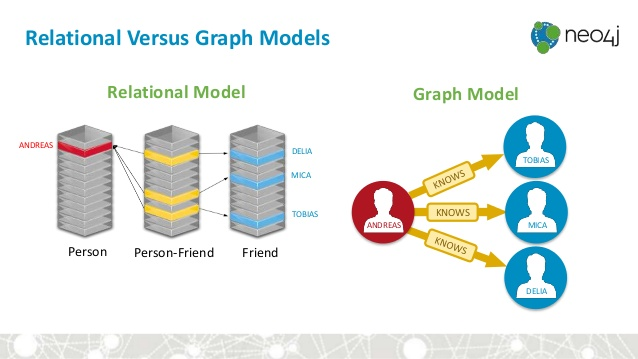

```{r setup, include=FALSE}
knitr::opts_chunk$set(
  echo = TRUE,
  fig.align = "center"
)
```

## The Challenge

Neo4J is a powerful Graph DataBase Management System (Graph DBMS) which is designed to store and interact with graph data, i.e. data which is defined as nodes and relationships.

As Neo4J states "Graphs are everywhere", and a graph model is used when we need to analyse relationships between elements: for example, if we want to retrieve a network of dependencies for R packages, when we want to build a recommandation engine, when analysing social networks like Twitter... 

Many popular tools in R have been developped to interact with tabular data (notably, the tidyverse). Packages like {igraph}, {tidygraph} or {ggraph} have helped bringing the "graph language" into R, and to interact with this formation with the tabular data tools we just mentioned. 

Yet, these packages are based on the premise that the data we want to analyse is already in the R environment. We propose to complete this set of tools with a suite of packages that are designed to complete this "graph analysis with R" workflow, by rebooting and extending the R for Neo4J driver. 

### About Neo4J

Neo4J has become in the recent years one of the most used graph database, adopted by companies like Airbnb, Microsoft, IBM, Orange, and many others. Coincidently enough, these companies also use R in their data science teams.

According to DB-Engines.com, Neo4J is the most popular Graph DataBase Management System (1) (Graph DBMS), and it's been the case since 2012. Neo4J ranks 22 on the list of all DBMS (2). A recent Stack Overflow survey ranks Neo4J 17th in the list of the most popular DBMS (3) (taking into account all systems), but in this top, Neo4J stays first if we only consider Graph DBMS.

### About Graph DBMS

Neo4J is a graph database management system. In classical relational databases, relationships are created at query time through join-like operations. In contrast, a graph database is a data platform that natively stores data as nodes and relationships (to embrace Neo4J terminology). Relationships are first class citizen, _i.e._ they natively exist.



> Difference between relationnal and graph databases (source: Neo4J)

Communication with Neo4J is done using Cypher. Cypher is a query language in ASCII art that allows to represent simple and complex relationships very synthetically. Here is an example of a query in Cypher: 

```
MATCH (n:Person {name: 'Colin'})-[*..3]->(p:Person)
RETURN p.name;
```

In this example, if we imagine we are in a social network, we are querying the name of all nodes that have from 1 to 3 levels of relationships with the node named "Colin". In a sense, we are querying friends, friends of friends, and friends of friends of friends. This is a simple, compact and expressive query that would be complex to write in SQL, for instance. 

Let's take another example: package-dependencies in R. If we want to retrieve a list of __all__ the dependencies of a package, we'll need to recursively filter for level 1, then for level 2, then level 3... and so on and so forth until there are no possible loop forward. A process that is quite verbose to write when we are dealing with tabular data, but which is straightforward if we are using a graph model. 

### Neo4J and R

`{RNeo4J}` is a package that has been developped by Nicole White, former data scientist at Neo4J. It hasn't been maintained for 2 years (August 2016), and was removed from CRAN on the 2018-02-10. The former maintainer wrote down on Github that she wouldn't continue to work on this package (4). Some commits have been made to the repo by an external developper, but there are (to this day) no clear will to maintain and modernize this package. 

### Why a reboot?

We strongly think that we can make Neo4J a legitimate part of the data science workflow with R by rebooting "R for Neo4J". 

Why a new series of packages? Because the way we see the suite of R packages for Neo4J would require too many breaking changes from the current package, something that would break a lot of processes for people currently working with the package. 

When working on this reboot, we'll be taking a 'R first' approach, i.e. we will : 

+ Focus on a user-friendly approach for R users
+ Focus on parsing Neo4J results and return a data format that will be easy to manipulate in R, but at the same time we'll keep in mind that we need to stay as close as possible to Neo4J data format. 
+ Focus on making it possible to easily combine Neo4J results with other R packages such as {igraph}, {ggraph}, {tidygraph}, {d3Networks}... Something that is not possible given the current state of {RNeo4J}(6). 

### Why several packages

This project will embrace the unix philosophy of modularity for several reasons:

+ The packages can be used separately, or all together. Hence, we think it's better to have 5 separate tools that each focus on one task than one big package performing various tasks.
+ This approach makes the maintainance easier.
+ It's easier for the end user to learn how to use a package of medium size, than to start by digging into a big package.
+ It will make it easier to build tools relying on these packages (i.e, using these packages as dependencies).
+ It's simpler for contributors to to dig into smaller packages than to understand the logic of a big packages developped for various tasks. 

## The plan

### Rebooting R for Neo4J 

#### {neo4r}

We offer to reboot the "R driver for Neo4J" with a brand new package that will be built upon modern tools. To name a few: {R6} for the core connexion object, {jsonlite} for parsing the API results, {purrr} for dealing with the results of the API, and {tibble} for more pleasant printing of the result.  

We'll also be focusing on flexibility of data manipulation: 

+ Minimize the transformation of API results: we believe that this package needs to respect as much as possible data returned by Neo4J, but also to give to the user a data format that can be easily be. That is to say that the "heavy lifting" of dealing with parsing the API results should not be left to the end user. 
+ Using a data-format that has a very small (if any) deviation from the "tidy data" principles (5): response should be in one dataframe by set of observations, and relationships and nodes being data elements in Neo4J, we're planning on using a one-node-by-row and one-relationship-by-row format. 
+ Use a "pipe-friendly" approach. 
+ With {R6}, we'll let the user easily manipulate the connexion object.

We will also update the API endpoints used in the package to be consistent with the new version of Neo4J. 

A first proof of concept of the package can be found on [https://github.com/neo4j-rstats/neo4r](https://github.com/neo4j-rstats/neo4r). 

### Extending R for Neo4J 

Up to now, Neo4J with R only relied on a single package used for querying and retrieving data. We think we can build more tools to help R users take full advantage of Neo4J in R. We believe that Extending R for Neo4J requires the implementation of complementary packages to {neo4r}, which are: 

#### {rmd4j}: a knitr engine for Neo4J

This package will help to create automated reports combining R and Neo4J. There is currently no native Neo4J support in RMarkdown. 

A first proof of concept of the package can be found on <https://github.com/ThinkR-open/rmd4j>

#### {shiny4j}: a shiny engine for Neo4J

This package will implement a Neo4J interaction with Shiny. This will allow to build Shiny apps that can mix Neo4J and R. 

#### {play4j} : Neo4J orchestration for R 

This package will be used to manipulate Neo4J command line tools from R. 

A first proof of concept of the package can be found on <https://github.com/ThinkR-open/play4j>.

#### {cyphersugar} : a cypher-query implementation in R

In order to make it easier for R users to interact with Neo4J through cypher (the query language for Neo4J), this package will implement a syntaxic sugar to write R-friendly functions that will be turned into cypher queries. This package will be inspired by what dbplyr does with SQL. 

For example, we want to implement a package that will allow to write this cypher-query:

```
MATCH (n:Person {name: 'Colin'})-[:KNOWS]->(p:Person)
RETURN p.name;
```

in R : 

```{r eval = FALSE}
MATCH %>% 
  node(n = Person, properties = list(name = "Colin")) %>%
  relates(type = "KNOWS", direction = "to") %>%
  node(p = Person) %>% 
  RETURN(p$name)
```

> Note: this is just an example, and does not reflect exactly what {cyphersugar} will be. 

## The Team

### R software engineering 

The engineering for the R package will be made by: 

+ Colin Fay - ThinkR 
+ Diane Beldame - ThinkR
+ Sebastien Rochette - ThinkR
+ Vincent Guyader - ThinkR

> About ThinkR: ThinkR is a french-based company that works with everything R and data science related. We focus on software engineering, package development and training. 

The packages will be hosted on GitHub, opened for external contributions. Each packages have a Code of Conduct, and will be completed with a contribution guide. 

Every contribution will be welcome, be it from a beginner or a confirmed developer. We hope that the community will grasp this opportunity to work with us, and that people not knowing Neo4J will learn about this Graph DBMS and about the Cypher query language.

### Support from the Neo4J team

So far, our first efforts has been supported by the Neo4J team, as they featured us on the blog and in the developers newsletter twice (7) and (9). They also have offered us to write an invited post on their blog to communicate about this project. 

### Beta testers 

We gathered a list of 8 beta testers, that will help us test along our developments. A list can be found on the GitHub repo of this proposal (9). 

## Milestone 

### First package: {neo4r}

The {neo4r} package will be the backbone of this project. This requires three main actions: 

+ Getting a stable package, released on GitHub, and get it tested by the users. End the implementation of all the features. 
+ Build a reliable testing engine for R with Neo4J
+ Write a complete documentation (package doc + Vignettes)
+ Getting the package released on CRAN

> Estimated time: 2 months between the stable version on GitHub and the CRAN release

### Second package: {rmd4j}

{rmd4j} package will rely on {neo4r}. Its development process will be the quickest. 

+ Getting a functionnal package, released on GitHub, and get it tested by the users
+ Write a complete documentation (package doc + Vignettes)
+ Getting the package released on CRAN

> Estimated time: 1 month between the stable version on GitHub and the CRAN release


### Third package: {shiny4j}

{shiny4j} package will require a more complex engineering.

+ Getting a functionnal package, released on GitHub, and get it tested by the users
+ Write a complete documentation (package doc + Vignettes)
+ Getting the package released on CRAN

> Estimated time: 2 to 3 months between the stable version on GitHub and the CRAN release

#### Complementary packages: {play4j} and {cyphersugar}

These packages can be considered as less central to the R-Neo4J driver. They will be developed in parallel with the packages previously described. 

As they are less fundamental to the R-Neo4J reboot and extension, they won't be included in the grant programm. However, we estimate their release to be concomitant with the release of {shiny4j}. 

### Communicating on the R-Neo4J reboot

A big part of a project success is communication. We plan to participate in conferences and meetups to present the result of this reboot, and give workshop on the use of these packages. 

We also plan to write a manual using {bookdown} that will be called "Using Neo4J from R". It will guide through the whole process of using the packages we've developed. This will be freely available.

## How Can The ISC Help

R and Neo4J are both open-source technologies for companies and academic applications. All the packages we mentioned will be release as open source tools, and we hope they will be adopted by a large audience of academics and professionnals. 

We are asking for a grant to support the working time spent to develop these tools, and to promote them. We plan on spending around 10 days a month on these tools. We are asking for the support of half of these days from the RConsortium (_i.e._ 5.000$ a month). The other half will be covered by ThinkR, in its effort to support Open Source Software. ThinkR will free 5 days a month of working time for us to work on these projects.  

Below is a summary of our needs: 

+ For Software Engineering 

|What                |   How long|  How much|
|-------------------:|----------:|---------:|
|{neo4r}             |  2 months |  10.000  |
|{rmd4j}             |  1 months |  5.000   |
|{shiny4j}           |  2 months |  10.000  |

+ For Dissemination 

|  What              |  How long         |  How much|
|-------------------:|------------------:|---------:|
|"Using Neo4J from R"|  0.5 months       |  2.500   |
|Meetups             |  2 to 3 meetups   |  2.500   |

## Dissemination 

A "neo4j-rstats" GitHub organisation has been opened to gather the elements of the project. 

All packages mentioned will be made open source, with the code published on this GitHub organisation continuously as we work on the development. When we will have reached a stable version, an official release will be made on CRAN. 

Neo4J Community Edition and R are both GPL3, so all packages presented here will be licenced as such. 

We will publicise our work through several channels: 

+ Blogposts on R related blogs (on ThinkR and others)
+ Blogposts on the Neo4J blog 
+ Conference talks & meetup 
+ "Using Neo4J from R" book
+ Article proposals on R and sofware engineering journals (R Journals)
+ Online Webinars / videos 

## Footnotes 

(1) DB-Engines Ranking of Graph DBMS : https://db-engines.com/en/ranking/graph+dbms
(2) DB-Engines Ranking of DBMS : https://db-engines.com/en/ranking
(3) SO Developer Survey Results 2018 : https://insights.stackoverflow.com/survey/2018/#technology-databases
(4) https://github.com/nicolewhite/RNeo4j/pull/69#issuecomment-372143211
(5) Hadley Wickham. "Tidy data". The Journal of Statistical Software, vol. 59, 2014. http://vita.had.co.nz/papers/tidy-data.html
(6) Currently, {RNeo4J} doesn't allow to return a graph object (i.e. two tables, one with the nodes and one with the relationships). 
(7) https://neo4j.com/blog/this-week-neo4j-rmarkdown-new-apoc-release-finding-duplicates/ 
(9) https://neo4j.com/blog/this-week-neo4j-property-based-access-control-intro-cypher-user-path-analysis/#podcast
(9) https://github.com/ThinkR-open/isc-proposal/issues/2
