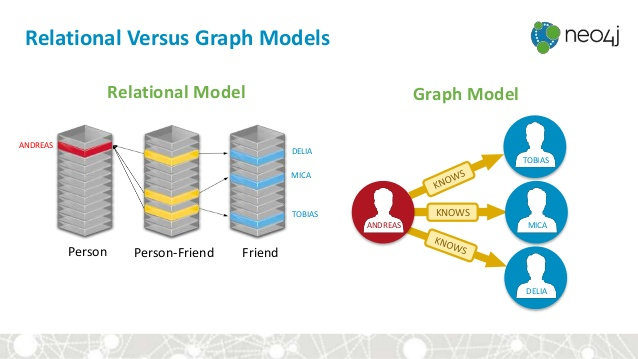

Rebooting and Extending R for Neo4J
================
Colin FAY
2018-03-13

## The Problem

### About Neo4J

Neo4J has become in the recent years one of the most used graph
database, adopted by companies like Airbnb, Microsoft, IBM, Orange, and
many others. Coincidently enough, these companies also use R in their
data science teams.

// TODO : add academic use cases

Neo4J is a graph database. In classical relational databases,
relationships are created at query time through join-like operations. In
contrast, a graph database is a data platform that natively stores data
as nodes and relationships (to embrace Neo4J terminology). Relationships
are first class citizen, *i.e.* they natively exist.



> Difference between relationnal and graph databases (source: Neo4J)

Developers, data scientists and more generally users can communicate
with Neo4J using Cypher. Cypher is a query language in ASCII art that
allows to represent simple and complex relationships very synthetically.

Example of a query in Cypher:

    MATCH (n:Person {name: 'Colin'})-[*..3]->(p:Person)
    RETURN p.name;

In this example, if we imagine we are in a social network, we are
querying the name of all nodes that have from 1 to 3 levels of
relationships with the node named “Colin”. In a sense, we are querying
friends, friends of friends, and friends of friends of friends. This is
a simple, compact and expressive query that would be complex to write in
SQL, for instance.

### Neo4J and R

The only R package that allowed to connect R with Neo4J, `{RNeo4J}`, has
not been maintained for 2 years.

This package has been removed from CRAN on the 2018-02-10. On its GitHub
repository, an issue is still unanswered about this CRAN removal. The
most recent commit has been made about 2 years ago (August 2016). At
that time, the official version of Neo4J was the 2.3.7, with the beta
being 3.1.0. As of today, the official Neo4J is 3.3.3. This package also
relies on an API endpoint that is now deprecated
<https://neo4j.com/docs/rest-docs/3.3/#rest-api-cypher>.

ThinkR’s team members have started working with Neo4J recently, notably
through a {knitr} engine for Neo4J. After this package first draft has
been published on GitHub, we have been contacted and encouraged by the
Neo4J team to help contributing to the development of the Neo4J - R API.

## The plan

### Rebooting R for Neo4J

#### {neo4r}

We offer to reboot the “R driver for Neo4J” with a brand new package
that will be built upon modern tools. To name a few: {R6} for the core
connexion object, {jsonlite} for parsing the API results, {purrr} for
dealing with the results of the API, and {tibble} for more pleasant
printing of the result.

We’ll also be focusing on flexibility of data manipulation:

  - Minimize transformation of API results: we believe that a package
    needs to respect as much as possible data sent by the API, but also
    to give to the user a data format that can easily be managed.
  - Use a “pipe-friendly” approach
  - Let the user easily manipulate the connexion object

As mentionned in the introduction, we will also update the API endpoints
used in the package to be consistent with the new version of Neo4J.

A first draft of the package can be found on []() // TODO

### Extending R for Neo4J

Up to now, Neo4J with R only relied on a single package used for
querying and retrieving data. We think we can build more tools to help R
users take full advantage of Neo4J in R. We believe that Extending R for
Neo4J requires the implementation of complementary packages to {neo4r}.

#### {rmd4j}: a knitr engine for Neo4J

This package will help to create automated reports combining R and
Neo4J. There is currently no native Neo4J support in RMarkdown.

A first draft of the package can be found on
<https://github.com/ThinkR-open/rmd4j>

#### {shiny4j}: a shiny engine for Neo4J

This package will implement a Neo4J interaction with Shiny. This will
allow to build Shiny apps that can mix Neo4J and R.

#### {play4j} : Neo4J orchestration for R

This package will be used to manipulate Neo4J command line tools from R.

A first draft of the package can be found on
<https://github.com/ThinkR-open/play4j>.

#### {cyphersugar} : a cypher-query implementation in R

In order to make it easier for R users to interact with Neo4J through
cypher (the query language for Neo4J), this package will implement a
syntaxic sugar to write R-friendly functions that will be turned into
cypher queries. This package will be inspired by what dbplyr does with
SQL.

For example, we want to implement a package that will allow to write
this cypher-query:

    MATCH (n:Person {name: 'Colin'})-[:KNOWS]->(p:Person)
    RETURN p.name;

in R :

``` r
MATCH %>% 
  node(n = Person, properties = list(name = "Colin")) %>%
  RELATES(type = "KNOWS", direction = "to") %>%
  node(p = Person) %>% 
  RETURN(p$name)
```

> Note: this is just an example, and does not reflect exactly what
> {cyphersugar} will be.

## The Team

### R software engineering

The engineering for the R package will be made by:

  - Colin Fay - ThinkR
  - Diane Beldame - ThinkR
  - Sebastien Rochette - ThinkR
  - Vincent Guyader - ThinkR

> About ThinkR: ThinkR is a french-based company that works with
> everything R and data science related. We focus on software
> engineering, package development and training.

As the package will be posted on GitHub, we hope to receive contributors
along the way.

### Support from the Neo4J team

So far, our first draft at {rmd4j} has already been supported by the
Neo4J team, as they featured it on the blog and in the developers
newsletter
<https://neo4j.com/blog/this-week-neo4j-rmarkdown-new-apoc-release-finding-duplicates/>.

### Beta testers

We gathered a list of ? beta testers, that will help us test along our
developments.

## Milestone

### First package: {neo4r}

{neo4r} package will be the backbone for the complementary packages.
This requires three main actions:

  - Getting a stable package, released on GitHub, and get it tested by
    the users
  - Build a reliable testing engine for R with Neo4J
  - Getting the package released on CRAN

> Estimated time: 2 months between the stable version on GitHub and the
> CRAN release

### Second package: {rmd4j}

{rmd4j} package will rely on {neo4r}. Its development process will be
the quickest.

  - Getting a functionnal package, released on GitHub, and get it tested
    by the users
  - Getting the package released on CRAN

> Estimated time: 1 month between the stable version on GitHub and the
> CRAN release

### Third package: {shiny4j}

{shiny4j} package will require a more complex engineering.

  - Getting a functionnal package, released on GitHub, and get it tested
    by the users
  - Getting the package released on CRAN

> Estimated time: 3 to 4 months between the stable version on GitHub and
> the CRAN release

#### Complementary packages: {play4j} and {cyphersugar}

These packages can be considered as less central to the R-Neo4J driver.
They will be developed in parallel with the packages previously
described.

As they are less fundamental to the R-Neo4J reboot and extension, they
won’t be included in the grant programm. However, we estimate their
release to be concomitant with the release of {shiny4j}.

### Communicating on the R-Neo4J reboot

A big part of a project success is communication. We plan to participate
in conferences and meetups to present the result of this reboot, and
give workshop on the use of these packages.

We also plan to write a manual using {bookdown} that will be called
“Using Neo4J from R”. It will guide through the whole process of using
the packages we’ve developed. This will be freely available.

## How Can The ISC Help

R and Neo4J are both open-source technologies for companies and academic
applications. All the packages we mentioned will be release as open
source tools, and we hope they will be adopted by a large audience of
academics and professionnals.

We are asking for a grant to support the working time spent to develop
these tools, and to promote them. We plan on spending around 10 days a
month on these tools. We are asking for the support of half of these
days from the RConsortium (*i.e.* 5.000$ a month). The other half will
be covered by ThinkR, in its effort to support Open Source Software.
ThinkR will free 5 days a month of working time for us to work on these
projects.

Below is a summary of our needs:

  - For Software Engineering

|      What | How long | How much |
| --------: | -------: | -------: |
|   {neo4r} | 2 months |   10.000 |
|   {rmd4j} | 1 months |    5.000 |
| {shiny4j} | 3 months |   15.000 |

  - For Dissemination

|                 What |       How long | How much |
| -------------------: | -------------: | -------: |
| “Using Neo4J from R” |     0.5 months |    2.500 |
|              Meetups | 2 to 3 meetups |    2.500 |

## Dissemination

All packages mentioned will be made open source, with the code published
on GitHub continuously as we work on the development. When we will have
reached a stable version, an official release will be made on CRAN.

Neo4J Community Edition and R are both GPL3, so all packages presented
here will be licenced as such.

We will publicise our work through several channels:

  - Blogposts on R related blogs (on ThinkR and others)
  - Blogposts on the Neo4J blog // TO CONFIRM
  - Conference talks & meetup
  - “Using Neo4J from R” book
  - Article proposals on various journals
  - Online Webinars / videos
